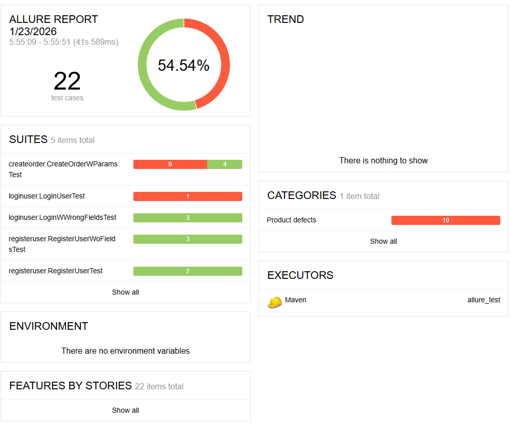
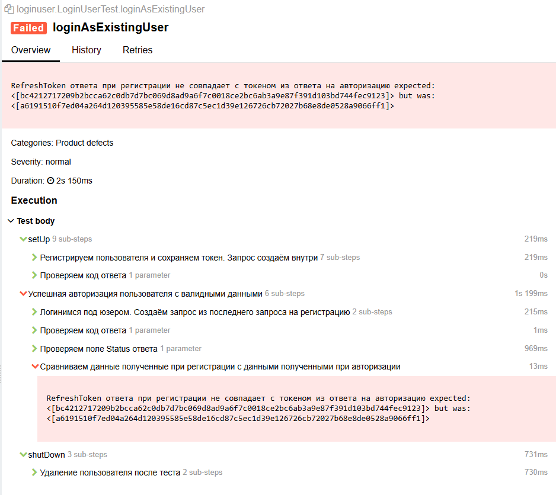
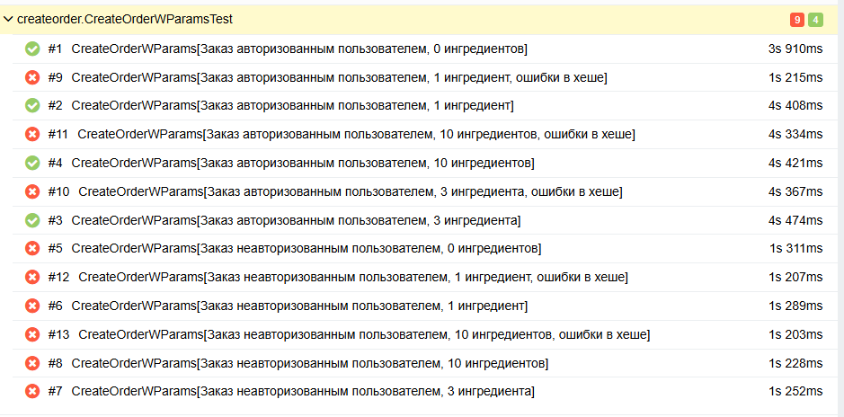
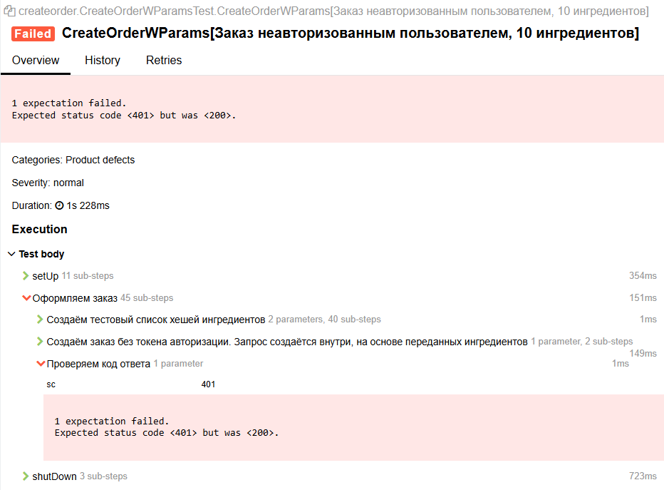
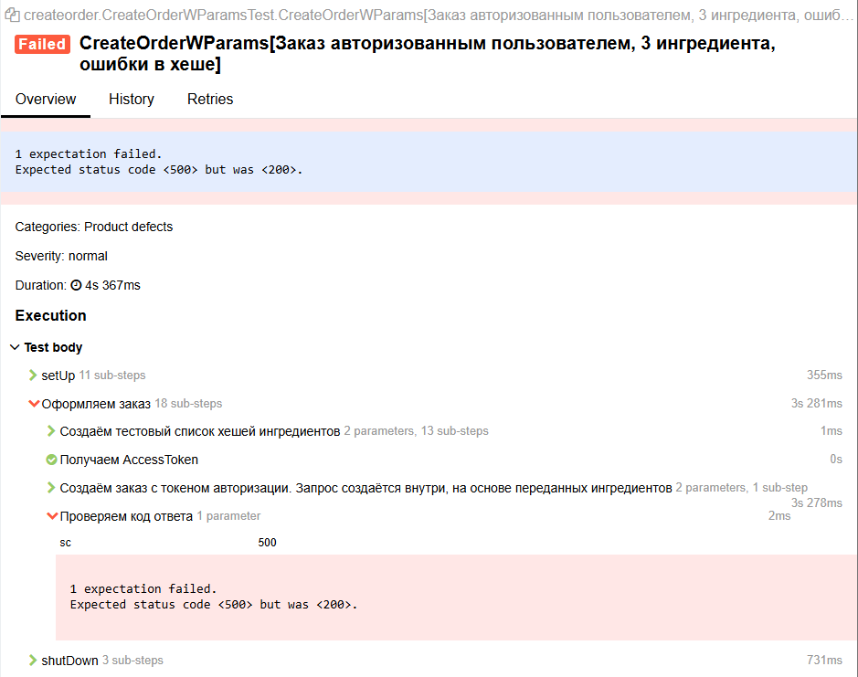

# Дипломная работа. Задание 2: Тестирование API

Нужно протестировать API сервиса создания бургеров [Stellar Burgers](https://stellarburgers.education-services.ru/).  
[Документация](https://code.s3.yandex.net/qa-automation-engineer/python-full/diploma/Api-Stellar_Burgers.pdf) к API.

## Необходимо протестировать следующее:
### Создание пользователя:
- создать уникального пользователя;
- создать пользователя, который уже зарегистрирован;
- создать пользователя и не заполнять одно из обязательных полей.

### Логин пользователя:
- вход под существующим пользователем;
- вход с неверным логином и паролем.

### Создание заказа:
- с авторизацией;
- без авторизации;
- с ингредиентами;
- без ингредиентов;
- с неверным хешем ингредиентов.

## Использовала
- JUnit 4
- Allure
- RestAssured
- Параметризацию тестов

## Сделала
- 8 POJO класса
- 5 тестовых класса, 3 из которых параметризованы
- 5 вспомогательных класса, в которые вынесена основная логика тестов, что позволило избежать большого количества дублирования кода.
- Все методы имеют аннотацию Step, чтобы тесты можно было просмотреть по шагам, а все запросы и ответы логируются.
- Все тестовые данные генерируются рандомно

## Результат прохождения тестов
Из 22 тестов успешно пройдено 12 тестов (54.54%).



#### Регистрация
Пользователь успешно регистрируется. Мне кажется, что возвращаемый код 200 Ok не корректен и должен приходить код 201 Created, но в проверке оставила 200 Ok.

#### Авторизация  
Авторизация происходит успешно.  
Обнаружила, что после авторизации приходят неверные AccessToken и RefreshToken. В документации сказано, что 
AccessToken может быть просрочен через 20 минут после создания, но ничего не сказано о том, что он может меняться самостоятельно.  
Для изменения AccessToken нужно использовать ручку `/api/auth/token`, используя RefreshToken, чего в рамках тестирования 
не делала, значит токен меняться не должен.  
Про возможное изменение токена RefreshToken в документации также ничего не сказано.  
Это стало причиной падения теста.



#### Создание заказа
Большое количество несоответствия кодов ответа относительно документации.


- Неавторизованный пользователь (без передачи токена авторизации в запросе) не должен иметь возможность совершить заказ, но заказ 
оформляется. Ожидается 401 Unauthorized, получаем 200 OK.



- При передаче невалидного хеша хотя бы одного ингредиента, ожидается 500 Internal Server Error (но правильнее было
  бы 400 Bad Request). На деле заказ всё равно оформляется, но без этого ингредиента. Если невалидный ингредиент единственный в заказе, получаем 400 Bad Request.



## Дополнительно
- В документации не сказано о необходимости разлогина перед удалением пользователя, поэтому не стала добавлять разлогин в конце тестов.
- В документации отсутствует ручка отмены заказа, поэтому не смогла удалить созданные во время тесты заказы по завершении тестов.

## Просмотр результатов Allure
В репозитории лежат результаты Allure. 
Чтобы сгенерировать новый результат, вызовите:
```
mvn clean test
```
Чтобы просмотреть результат, запустите:
```
mvn allure:serve
```
